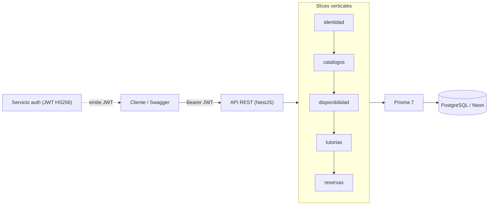

# Microservicio de Tutorías Académicas — ECIWise

Microservicio REST de **gestión de tutorías académicas** para la Escuela Colombiana de
Ingeniería Julio Garavito. Forma parte del ecosistema **ECIWise** y gestiona la oferta de
disponibilidad de los tutores, la materialización de slots, la búsqueda y la reserva de
tutorías por parte de los estudiantes.

---

## Tabla de contenido

- [Objetivo de negocio](#objetivo-de-negocio)
- [Características principales](#características-principales)
- [Arquitectura de alto nivel](#arquitectura-de-alto-nivel)
- [Tecnologías](#tecnologías)
- [Estructura del proyecto](#estructura-del-proyecto)
- [Requisitos previos](#requisitos-previos)
- [Instalación y configuración](#instalación-y-configuración)
- [Variables de entorno](#variables-de-entorno)
- [Ejecución local](#ejecución-local)
- [Ejecución con Docker](#ejecución-con-docker)
- [Pruebas](#pruebas)
- [Endpoints](#endpoints)
- [Convenciones de desarrollo](#convenciones-de-desarrollo)
- [Flujo de trabajo Git](#flujo-de-trabajo-git)
- [Despliegue](#despliegue)
- [Troubleshooting](#troubleshooting)
- [Contribución](#contribución)
- [Licencia](#licencia)

---

## Objetivo de negocio

Centralizar y digitalizar el acompañamiento académico entre **tutores** (monitores) y
**estudiantes**: que un tutor declare su disponibilidad recurrente una sola vez, que el sistema
genere automáticamente los slots reservables, y que el estudiante pueda **buscar y reservar**
tutorías (virtuales o presenciales) con control de cupos, eliminando los horarios en papel y los
desplazamientos sin saber si hay cupo.

## Características principales

- **Catálogos** institucionales: materias, salas, franjas horarias y asignación tutor–materia.
- **Disponibilidad recurrente**: el tutor publica plantillas (materia, modalidad, cupos, vigencia) sobre franjas institucionales.
- **Materialización** acotada: un job expande las plantillas en tutorías concretas (`Tutoria`) dentro de una ventana móvil, de forma idempotente.
- **Búsqueda y consulta** de slots con cupo disponible (filtros por materia, modalidad, fecha, tutor).
- **Reservas** con garantías de concurrencia: control atómico de cupos (RN-09), sin traslapes (RN-01), cancelación, reprogramación atómica y cancelación de la tutoría por el tutor.
- **Espejo local de usuarios** poblado de forma perezosa desde el JWT (sin acoplar a `auth` en lecturas).
- **Eventos de dominio** publicados desde el día uno (publisher in-memory; preparado para RabbitMQ).
- **API documentada** con Swagger en `/api/docs`.

## Arquitectura de alto nivel

**Arquitectura Hexagonal (Ports & Adapters) + Vertical Slicing + DDD.** Cada capability de
negocio es un *slice* vertical con su propio dominio, aplicación e infraestructura. Las
dependencias apuntan hacia adentro: Infraestructura → Aplicación → Dominio (TypeScript puro,
sin frameworks).



Grafo de dependencias entre slices:

```
catalogos → disponibilidad → [job materialización] → tutorias → reservas
identidad → transversal (lecturas de todos)
```

## Tecnologías

| Categoría | Tecnología |
|---|---|
| Runtime | Node.js ≥ 20 (probado con v26), TypeScript estricto |
| Framework | NestJS 11 |
| ORM / BD | Prisma 7 + PostgreSQL (hospedado en Neon) |
| Validación | `class-validator` + `class-transformer` |
| Documentación API | `@nestjs/swagger` (OpenAPI) |
| Autenticación | JWT HS256 emitido por `auth` (`passport-jwt`) |
| Scheduling | `@nestjs/schedule` (cron de materialización) |
| Eventos | `@nestjs/event-emitter` (publisher in-memory) · RabbitMQ (fase posterior) |
| Pruebas | Jest (unitarias de dominio + casos de uso con fakes) |
| Lint/format | ESLint + Prettier (Husky + lint-staged) |

## Estructura del proyecto

```
src/
├── main.ts, app.module.ts
├── config/                    # validación de entorno (Joi)
├── shared/                    # shared kernel
│   ├── domain/                # ValueObject base, VOs, enums, errores, eventos (puerto)
│   └── infrastructure/        # PrismaService, ExceptionFilter, publisher in-memory
├── auth/                      # JwtStrategy, guards, decorators, tipos
└── modules/                   # slices verticales
    ├── identidad/             # espejo local de usuarios (captura perezosa del JWT)
    ├── catalogos/             # materias, salas, franjas, tutor-materia
    ├── disponibilidad/        # plantillas recurrentes + job de materialización
    ├── tutorias/              # búsqueda y consulta de slots (lectura)
    └── reservas/              # reservar, cancelar, reprogramar, cancelar por tutor
prisma/
├── schema.prisma             # modelo de datos
├── migrations/               # historial de migraciones
└── seed.ts                   # franjas (L-V × 8 bloques) y salas (A/B/C 100-110)
```

Cada slice sigue la estructura: `domain/{entities,value-objects,events,ports/outbound}` ·
`application/use-cases` · `infrastructure/{persistence,http/{controllers,dto}}` · `<slice>.module.ts`.

## Requisitos previos

- **Node.js ≥ 20** y **npm**.
- Una base de datos **PostgreSQL** (el proyecto usa **Neon**; sirve cualquier Postgres ≥ 14).
- El **`JWT_SECRET` compartido** con el servicio `auth` (HS256) para validar los tokens.

## Instalación y configuración

```bash
git clone <repo-url>
cd tutoring
npm install
cp .env.example .env         # crea/edita tu .env (ver variables abajo)
npx prisma generate          # genera el cliente Prisma
npx prisma migrate deploy    # aplica migraciones (o `migrate dev` en desarrollo)
npx prisma db seed           # siembra franjas y salas (idempotente)
```

> **Nota Prisma 7:** el generador usa un `output` custom (`generated/prisma`). `prisma migrate dev`
> **no** regenera el cliente automáticamente: tras cualquier cambio de schema, corre siempre
> `npx prisma generate`.

## Variables de entorno

Validadas con Joi al arranque (`src/config/env.validation.ts`); si falta una requerida, la app no arranca.

| Variable | Requerida | Default | Descripción |
|---|---|---|---|
| `NODE_ENV` | no | `development` | `development` \| `production` \| `test` |
| `PORT` | no | `3000`* | Puerto HTTP (*`main.ts` cae a `3001` si no está definida) |
| `DATABASE_URL` | **sí** | — | Conexión **pooled** (runtime) a Postgres/Neon |
| `DIRECT_URL` | **sí** | — | Conexión **directa** (migraciones). No mezclar con la anterior |
| `JWT_SECRET` | **sí** | — | Secreto HS256 compartido con `auth` (mín. 16 chars) |
| `JWT_EXPIRATION` | no | `1h` | TTL informativo del token |
| `MATERIALIZACION_VENTANA_SEMANAS` | no | `2` | Semanas hacia adelante que materializa el job |
| `RABBITMQ_URL` | no | — | Reservado para la fase de mensajería (aún no usado) |

## Ejecución local

```bash
npm run start:dev     # desarrollo con watch
npm run build         # compilar a dist/
npm run start:prod    # node dist/src/main
npm run seed          # sembrar franjas + salas
```

La app expone **Swagger** en `http://localhost:<PORT>/api/docs`.

### Autenticarse para probar

Todas las rutas exigen un **Bearer JWT** firmado con `JWT_SECRET` (HS256). Payload esperado:
`{ sub, email, nombre, apellido, rol }` con `rol ∈ { estudiante, tutor, admin }`. En desarrollo
puedes firmar uno manualmente (mismo secreto del `.env`) y usar **Authorize** en Swagger.

## Ejecución con Docker

> **No disponible aún:** el repositorio no incluye `Dockerfile` ni `docker-compose.yml`. La BD se
> consume como servicio gestionado (Neon). Pendiente para una fase de empaquetado.

## Pruebas

```bash
npm test              # unitarias (dominio puro + casos de uso con fakes in-memory)
npm run test:cov      # con cobertura
npm run test:e2e      # end-to-end (config en test/jest-e2e.json)
```

Estrategia: el **dominio** se prueba con tests unitarios puros (sin mocks); los **casos de uso**
con repositorios in-memory (fakes de los puertos); la concurrencia de cupos (RN-09) se valida
contra Postgres real. Estado actual: **~89 tests** en verde.

## Endpoints

Documentación viva en `/api/docs`. Todas las rutas requieren JWT; los roles indican autorización adicional.

| Módulo | Método | Ruta | Rol |
|---|---|---|---|
| identidad | GET | `/identidad/me` | autenticado |
| identidad | GET | `/identidad/usuarios/:userId` | autenticado |
| catálogos | POST / GET | `/catalogos/materias` | admin / autenticado |
| catálogos | PATCH | `/catalogos/materias/:id/activar` · `/desactivar` | admin |
| catálogos | POST / GET | `/catalogos/salas` | admin / autenticado |
| catálogos | POST / GET | `/catalogos/franjas` | admin / autenticado |
| catálogos | POST / GET | `/catalogos/tutor-materias` | admin / autenticado |
| catálogos | PATCH | `/catalogos/tutor-materias/:id/autorizar` · `/desautorizar` | admin |
| disponibilidad | POST / GET | `/disponibilidad` | tutor o admin |
| disponibilidad | PATCH | `/disponibilidad/:id` · `/:id/desactivar` | tutor o admin |
| disponibilidad | POST | `/disponibilidad/materializacion` | admin |
| tutorías | GET | `/tutorias` · `/tutorias/:id` | autenticado |
| reservas | POST | `/reservas` | estudiante |
| reservas | POST | `/reservas/:tutoriaId/cancelar` | estudiante |
| reservas | POST | `/reservas/reprogramar` | estudiante |
| reservas | POST | `/reservas/cancelacion-tutoria` | tutor o admin |

## Licencia

UNLICENSED — uso académico interno (Escuela Colombiana de Ingeniería Julio Garavito).
